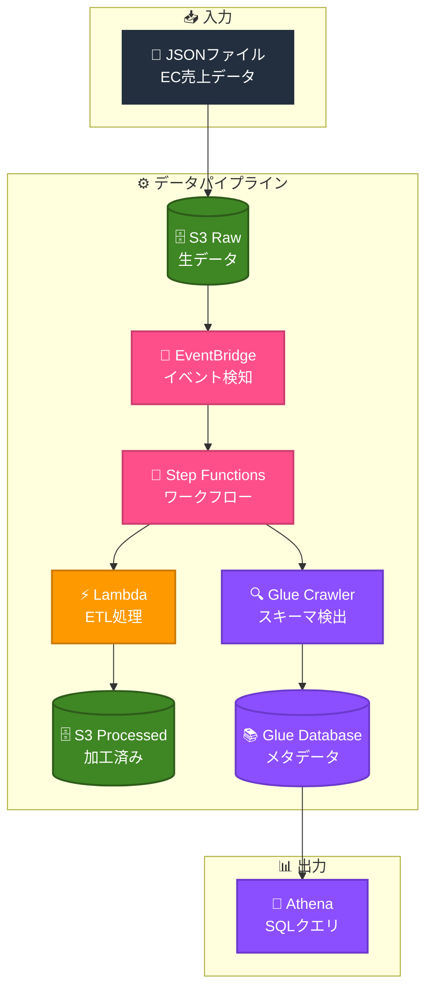

# Data Pipeline - AWS × Terraform

AWS × Terraform でデータパイプラインを構築する学習プロジェクト

## 1. 概要

EC売上データ（JSON）を自動で分析可能な状態（Parquet）に変換するサーバーレスパイプラインです。

### 1-1. データフロー

```
JSON → S3 Raw → EventBridge → Step Functions → Lambda → S3 Processed → Glue Crawler → Athena
```

### 1-2. 処理の流れ

1. JSONファイルをS3 Rawにアップロード
2. EventBridgeがアップロードを検知
3. Step Functionsがワークフローを開始
4. LambdaがJSON→Parquet変換
5. S3 Processedに保存
6. Glue Crawlerがスキーマを検出
7. Athenaでクエリ可能に

## 2. アーキテクチャ



## 3. 技術スタック

| カテゴリ | 技術 |
|----------|------|
| IaC | Terraform 1.0.0+ |
| Provider | hashicorp/aws ~> 5.0 |
| Runtime | Python 3.12 |
| Region | ap-northeast-1 (東京) |

### 3-1. AWS サービス

| サービス | 用途 |
|----------|------|
| S3 | データ保存（Raw/Processed） |
| Lambda | ETL処理（JSON→Parquet） |
| Step Functions | ワークフロー管理 |
| Glue | メタデータ管理（Crawler/Database） |
| EventBridge | イベント駆動トリガー |
| Athena | SQLクエリ |
| SNS | エラー通知 |
| CloudWatch | 監視・アラーム |
| IAM | 権限管理 |

## 4. ディレクトリ構成

```
pipeiac02/
├── .github/
│   └── workflows/
│       ├── terraform-plan.yml    # PR時にplan実行
│       └── terraform-apply.yml   # mainマージ時にapply
├── test-data/                    # テスト用サンプルデータ
│   ├── ec-sales-03.json          # 第3回：Lambda ETLテスト
│   ├── ec-sales-05.json          # 第5回：Step Functionsテスト
│   ├── ec-sales-06.json          # 第6回：EventBridge自動起動テスト
│   ├── iam-test.json             # 第7回：IAM権限テスト
│   ├── error-test-ok.json        # 第8回：エラーハンドリング正常系
│   ├── monitor-test.json         # 第9回：CloudWatch監視テスト
│   ├── refactor-test.json        # 第10回：リファクタリング後テスト
│   ├── e2e-test.json             # 第12回：E2E正常系テスト
│   ├── invalid-json.json         # 第12回：E2E異常系（不正JSON）
│   └── empty-array.json          # 第12回：E2E異常系（空配列）
├── tf/                           # Terraformコード
│   ├── main.tf                   # プロバイダ設定
│   ├── variables.tf              # 変数定義
│   ├── outputs.tf                # 出力値
│   ├── backend.tf                # S3バックエンド設定（オプション）
│   ├── terraform.tfvars          # 変数値（要作成）
│   ├── s3.tf                     # S3バケット
│   ├── iam.tf                    # IAMロール・ポリシー
│   ├── lambda.tf                 # Lambda関数
│   ├── glue.tf                   # Glue Crawler/Database
│   ├── stepfunctions.tf          # Step Functions
│   ├── eventbridge.tf            # EventBridge
│   ├── sns.tf                    # SNS
│   ├── cloudwatch.tf             # CloudWatch
│   └── lambda/
│       └── etl.py                # Lambda関数コード
└── README.md                     # このファイル
```

## 5. セットアップ

### 5-1. 前提条件

- Terraform 1.0.0+
- AWS CLI（設定済み）
- AWS アカウント

### 5-2. 手順

#### 5-2-1. リポジトリをクローン

```bash
git clone https://github.com/shu130/pipeiac02.git
cd pipeiac02
```

#### 5-2-2. 変数ファイルを作成

```bash
cd tf
touch terraform.tfvars
```

#### 5-2-3. terraform.tfvars を編集

```hcl
project       = "dp"
environment   = "dev"
aws_region    = "ap-northeast-1"
bucket_suffix = "20260115"        # 任意のサフィックス
alert_email   = "your@email.com"  # SNS通知先
```

#### 5-2-4. Terraform 初期化・適用

```bash
terraform init
terraform plan
terraform apply
```

#### 5-2-5. SNS サブスクリプション確認

メールに届く確認リンクをクリックして承認

### 5-3. （オプション）S3バックエンドの有効化

チーム開発やCI/CDを使う場合は、tfstateをS3で管理することを推奨します。

#### 5-3-1. S3バケット作成

```bash
aws s3 mb s3://dp-tfstate-bucket --region ap-northeast-1

# バージョニング有効化（推奨）
aws s3api put-bucket-versioning \
  --bucket dp-tfstate-bucket \
  --versioning-configuration Status=Enabled
```

#### 5-3-2. backend.tf のコメントを解除

`tf/backend.tf` を開き、コメントを解除します。

#### 5-3-3. State移行

```bash
cd tf
terraform init -migrate-state
```

**確認メッセージが表示されたら `yes` と入力**

## 6. 使い方

### 6-1. データをアップロード

```bash
# バケット名を取得
RAW_BUCKET=$(terraform output -raw raw_bucket_id)

# テストデータをアップロード
aws s3 cp test-data.json s3://$RAW_BUCKET/input/
```

### 6-2. パイプライン実行確認

```bash
# Step Functions の実行状態を確認
SFN_ARN=$(terraform output -raw sfn_arn)
aws stepfunctions list-executions --state-machine-arn $SFN_ARN --max-results 1
```

### 6-3. Athena でクエリ

```bash
# Processed バケットを確認
PROCESSED_BUCKET=$(terraform output -raw processed_bucket_id)

# Athena でクエリ実行
aws athena start-query-execution \
  --query-string "SELECT * FROM dp_db.processed LIMIT 10" \
  --work-group primary \
  --result-configuration OutputLocation=s3://$PROCESSED_BUCKET/athena-results/
```

## 7. テストデータ

`test-data/` ディレクトリには、Qiita記事シリーズで使用するサンプルデータが含まれています。

### 7-1. ファイル一覧

| ファイル名 | 記事 | 用途 |
|-----------|------|------|
| `ec-sales-03.json` | 第3回 | Lambda ETLテスト |
| `ec-sales-05.json` | 第5回 | Step Functionsテスト |
| `ec-sales-06.json` | 第6回 | EventBridge自動起動テスト |
| `iam-test.json` | 第7回 | IAM権限テスト |
| `error-test-ok.json` | 第8回 | エラーハンドリング正常系 |
| `monitor-test.json` | 第9回 | CloudWatch監視テスト |
| `refactor-test.json` | 第10回 | リファクタリング後テスト |
| `e2e-test.json` | 第12回 | E2E正常系テスト |
| `invalid-json.json` | 第12回 | E2E異常系（不正JSON） |
| `empty-array.json` | 第12回 | E2E異常系（空配列） |

### 7-2. 使用例

```bash
# バケット名を取得
RAW_BUCKET=$(terraform output -raw raw_bucket_id)

# テストデータをアップロード（第3回の例）
aws s3 cp test-data/ec-sales-03.json s3://$RAW_BUCKET/input/ec-sales.json

# E2Eテスト（第12回）
aws s3 cp test-data/e2e-test.json s3://$RAW_BUCKET/input/
```

### 7-3. データ形式

すべてのJSONファイルは以下の形式です：

```json
[
  {"order_id": "XXX", "product": "商品名", "price": 価格, "quantity": 数量}
]
```

| フィールド | 型 | 説明 |
|-----------|-----|------|
| order_id | string | 注文ID |
| product | string | 商品名 |
| price | number | 価格（円） |
| quantity | number | 数量 |
| date | string | 日付（E2Eテストのみ） |

## 8. 作成されるリソース

| リソース | 名前 | 用途 |
|----------|------|------|
| S3 | dp-raw-* | 生データ保存 |
| S3 | dp-processed-* | 加工済みデータ保存 |
| Lambda | dp-etl | JSON→Parquet変換 |
| Glue Database | dp_db | メタデータ管理 |
| Glue Crawler | dp-crawler | スキーマ自動検出 |
| Step Functions | dp-pipeline | ワークフロー管理 |
| EventBridge Rule | dp-s3-upload | S3イベント検知 |
| SNS Topic | dp-alert | エラー通知 |
| CloudWatch Alarm | dp-lambda-errors | Lambda監視 |
| IAM Role | dp-lambda-etl-role, dp-glue-crawler-role, dp-sfn-role, dp-eventbridge-role | 各サービス用権限 |

## 9. クリーンアップ

```bash
cd tf
terraform destroy
```

## 10. 関連記事

このプロジェクトの詳細は Qiita 記事シリーズで解説しています（全12回）。

| # | タイトル | 内容 |
|---|----------|------|
| 1 | 全体像 | パイプラインの設計思想 |
| 2 | S3設計 | Raw/Processedの分離 |
| 3 | Lambda ETL | JSON→Parquet変換 |
| 4 | Glue Crawler | スキーマ自動検出 |
| 5 | Step Functions | ワークフロー制御 |
| 6 | EventBridge | イベント駆動トリガー |
| 7 | IAM最小権限 | セキュリティ設計 |
| 8 | エラーハンドリング | Retry/Catch/SNS通知 |
| 9 | CloudWatch監視 | アラーム・ダッシュボード |
| 10 | Terraform設計 | ファイル構成・変数管理 |
| 11 | CI/CD | GitHub Actions |
| 12 | 総まとめ | 振り返り・E2Eテスト |

## 11. ライセンス

MIT License

## 12. 作成者

[@shu130](https://github.com/shu130)

