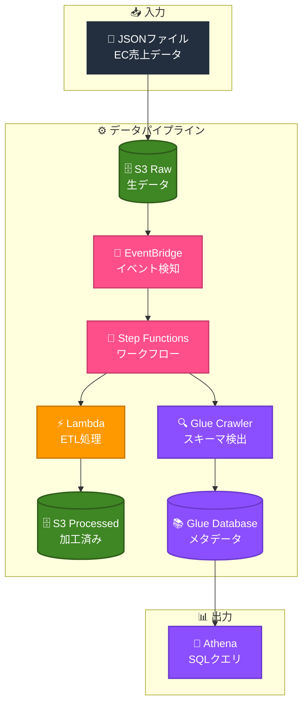

# Data Pipeline - AWS × Terraform

AWS × Terraform でデータパイプラインを構築する学習プロジェクト

## 1. 概要

EC売上データ（JSON）を自動で分析可能な状態（Parquet）に変換するサーバーレスパイプラインです。

### 1-1. データフロー

```
JSON → S3 Raw → EventBridge → Step Functions → Lambda → S3 Processed → Glue Crawler → Athena
```

### 1-2. 処理の流れ

1. JSONファイルをS3 Rawにアップロード
2. EventBridgeがアップロードを検知
3. Step Functionsがワークフローを開始
4. LambdaがJSON→Parquet変換
5. S3 Processedに保存
6. Glue Crawlerがスキーマを検出
7. Athenaでクエリ可能に

### 1-3. Qiita記事シリーズで解説（全12回）

**Phase 1: 基盤構築**

| # | タイトル | 内容 |
|---|----------|------|
| 1 | [全体像](https://qiita.com/shu_tana/items/e886bb72823f82a8a14a) | パイプラインの設計思想 |
| 2 | [S3設計](https://qiita.com/shu_tana/items/aa2ce567d7e1c24843e1) | Raw/Processedの分離 |
| 3 | [Lambda ETL](https://qiita.com/shu_tana/items/d642af8e97df6889c4a8) | JSON→Parquet変換 |
| 4 | [Glue Crawler](https://qiita.com/shu_tana/items/07a2ce2cf0c5dae6711b) | スキーマ自動検出 |

**Phase 2: ワークフロー**

| # | タイトル | 内容 |
|---|----------|------|
| 5 | [Step Functions](https://qiita.com/shu_tana/items/81cc4aae5f3c231aadd0) | ワークフロー制御 |
| 6 | [EventBridge](https://qiita.com/shu_tana/items/507eba3ede0a58191c70) | イベント駆動トリガー |

**Phase 3: セキュリティ・運用**

| # | タイトル | 内容 |
|---|----------|------|
| 7 | [IAM最小権限](https://qiita.com/shu_tana/items/aaca1883fc04d1ea8440) | セキュリティ設計 |
| 8 | [エラーハンドリング](https://qiita.com/shu_tana/items/719ade5d2907d476a6db) | Retry/Catch/SNS通知 |
| 9 | [CloudWatch監視](https://qiita.com/shu_tana/items/7c5f28b92833e4c2707b) | アラーム・ダッシュボード |

**Phase 4: 開発効率化**

| # | タイトル | 内容 |
|---|----------|------|
| 10 | [Terraform構成確認](https://qiita.com/shu_tana/items/06492bd33282a142290d) | ファイル構成・変数管理 |
| 11 | [CI/CD](https://qiita.com/shu_tana/items/642897b126f16053efd3) | GitHub Actions |
| 12 | [総まとめ](https://qiita.com/shu_tana/items/a1d8b47e9636bbcd7cd8) | 振り返り・E2Eテスト |

## 2. アーキテクチャ



## 3. 技術スタック

| カテゴリ | 技術 |
|----------|------|
| IaC | Terraform 1.0.0+ |
| Provider | hashicorp/aws ~> 5.0 |
| Runtime | Python 3.12 |
| Region | ap-northeast-1 (東京) |

### 3-1. AWS サービス

| サービス | 用途 |
|----------|------|
| S3 | データ保存（Raw/Processed） |
| Lambda | ETL処理（JSON→Parquet） |
| Step Functions | ワークフロー管理 |
| Glue | メタデータ管理（Crawler/Database） |
| EventBridge | イベント駆動トリガー |
| Athena | SQLクエリ |
| SNS | エラー通知 |
| CloudWatch | 監視・アラーム |
| IAM | 権限管理 |

## 4. ディレクトリ構成

第〇回は、Qiita記事の回の意味です。

```
pipeiac02/
├── .github/
│   └── workflows/
│       ├── terraform-plan.yml    # PR時にplan実行
│       └── terraform-apply.yml   # mainマージ時にapply
├── oidc/                         # OIDC認証設定（別管理推奨）
│   ├── main.tf
│   ├── variables.tf
│   └── outputs.tf
├── test-data/                    # テスト用サンプルデータ
│   ├── ec-sales-03.json          # 第3回：Lambda ETLテスト
│   ├── ec-sales-05.json          # 第5回：Step Functionsテスト
│   ├── ec-sales-06.json          # 第6回：EventBridge自動起動テスト
│   ├── iam-test.json             # 第7回：IAM権限テスト
│   ├── error-test-ok.json        # 第8回：エラーハンドリング正常系
│   ├── monitor-test.json         # 第9回：CloudWatch監視テスト
│   ├── refactor-test.json        # 第10回：リファクタリング後テスト
│   ├── e2e-test.json             # 第12回：E2E正常系テスト
│   ├── invalid-json.json         # 第12回：E2E異常系（不正JSON）
│   └── empty-array.json          # 第12回：E2E異常系（空配列）
├── tf/                           # Terraformコード
│   ├── main.tf                   # プロバイダ設定
│   ├── variables.tf              # 変数定義
│   ├── outputs.tf                # 出力値
│   ├── backend.tf                # S3バックエンド設定（オプション）
│   ├── terraform.tfvars          # 変数値（要作成）
│   ├── s3.tf                     # S3バケット
│   ├── iam.tf                    # IAMロール・ポリシー
│   ├── lambda.tf                 # Lambda関数
│   ├── glue.tf                   # Glue Crawler/Database
│   ├── stepfunctions.tf          # Step Functions
│   ├── eventbridge.tf            # EventBridge
│   ├── sns.tf                    # SNS
│   ├── cloudwatch.tf             # CloudWatch
│   └── lambda/
│       └── etl.py                # Lambda関数コード
└── README.md                     # このファイル
```

## 5. セットアップ

### 5-1. 前提条件

- Terraform 1.0.0+
- AWS CLI（設定済み）
- AWS アカウント

### 5-2. 手順

#### 5-2-1. リポジトリをクローン

```bash
git clone https://github.com/shu130/pipeiac02.git
cd pipeiac02
```

#### 5-2-2. 変数ファイルを作成

```bash
cd tf
touch terraform.tfvars
```

#### 5-2-3. terraform.tfvars を編集

```hcl
project       = "dp"
environment   = "dev"
aws_region    = "ap-northeast-1"
bucket_suffix = "20260115"        # 任意のサフィックス
alert_email   = "your@email.com"  # SNS通知先
```

#### 5-2-4. Terraform 初期化・適用

```bash
# tf/ ディレクトリで実行
terraform init
terraform plan
terraform apply
```

#### 5-2-5. SNS サブスクリプション確認

メールに届く確認リンクをクリックして承認

### 5-3. （オプション）S3バックエンドの有効化

チーム開発やCI/CDを使う場合は、tfstateをS3で管理することを推奨します。

#### 5-3-1. S3バケット作成

> **注意:** S3バケット名は**グローバルでユニーク**である必要があります。
> `dp-tfstate-bucket` は例です。自分専用のユニークな名前に変更してください。

```bash
aws s3 mb s3://dp-tfstate-bucket --region ap-northeast-1

# バージョニング有効化（推奨）
aws s3api put-bucket-versioning \
  --bucket dp-tfstate-bucket \
  --versioning-configuration Status=Enabled
```

#### 5-3-2. backend.tf のバケット名を変更

`tf/backend.tf` を開き、`bucket` を 5-3-1 で作成したバケット名に変更します。

```terraform
# tf/backend.tf

# Terraformの状態管理をS3で行う設定
# これにより、チームでの共有やCI/CDが可能になる
terraform {
  backend "s3" {
    bucket  = "dp-tfstate-bucket"           # 保存先バケット
    key     = "pipeline/terraform.tfstate"  # 保存ファイルのパス
    region  = "ap-northeast-1"              # リージョン
    encrypt = true                          # 暗号化を有効化
  }
}
```

#### 5-3-3. State移行

```bash
cd tf
terraform init -migrate-state
```

**確認メッセージが表示されたら `yes` と入力**

### 5-4. （オプション）OIDC認証の設定（CI/CD用）

GitHub ActionsからAWSを操作するには、OIDC認証の設定が必要です。
`oidc/` ディレクトリは `tf/` とは別管理です。

> 詳細は [第11回：CI/CD](https://qiita.com/shu_tana/items/642897b126f16053efd3) を参照してください。

#### 5-4-1. 変数ファイルを作成

```bash
cd oidc
touch terraform.tfvars
```

#### 5-4-2. terraform.tfvars を編集

```hcl
github_username = "your-github-username"  # GitHubユーザー名
github_repo     = "pipeiac02"             # リポジトリ名
```

#### 5-4-3. Terraform 初期化・適用

```bash
# oidc/ ディレクトリで実行
terraform init
terraform plan
terraform apply
```

> **注意:** `oidc/` は一度だけ実行すれば完了です。
> 以降のパイプライン管理は `tf/` ディレクトリで行います。

## 6. 使い方

> **注意:** 以下のコマンドはすべて `tf/` ディレクトリで実行してください。

### 6-1. データをアップロード

```bash
# バケット名を取得
RAW_BUCKET=$(terraform output -raw raw_bucket_id)

# テストデータをアップロード（例：第3回のテストデータ）
aws s3 cp test-data/ec-sales-03.json s3://$RAW_BUCKET/input/ec-sales.json
```

### 6-2. パイプライン実行確認

```bash
# Step Functions の実行状態を確認
SFN_ARN=$(terraform output -raw sfn_arn)
aws stepfunctions list-executions --state-machine-arn $SFN_ARN --max-results 1
```

### 6-3. Athena でクエリ

```bash
# Processed バケットを確認
PROCESSED_BUCKET=$(terraform output -raw processed_bucket_id)

# Athena でクエリ実行
aws athena start-query-execution \
  --query-string "SELECT * FROM dp_db.processed LIMIT 10" \
  --work-group primary \
  --result-configuration OutputLocation=s3://$PROCESSED_BUCKET/athena-results/
```

## 7. テストデータ

`test-data/` ディレクトリには、Qiita記事シリーズで使用するサンプルデータが含まれています。

### 7-1. ファイル一覧

| ファイル名 | 記事 | 用途 |
|-----------|------|------|
| `ec-sales-03.json` | 第3回 | Lambda ETLテスト |
| `ec-sales-05.json` | 第5回 | Step Functionsテスト |
| `ec-sales-06.json` | 第6回 | EventBridge自動起動テスト |
| `iam-test.json` | 第7回 | IAM権限テスト |
| `error-test-ok.json` | 第8回 | エラーハンドリング正常系 |
| `monitor-test.json` | 第9回 | CloudWatch監視テスト |
| `refactor-test.json` | 第10回 | リファクタリング後テスト |
| `e2e-test.json` | 第12回 | E2E正常系テスト |
| `invalid-json.json` | 第12回 | E2E異常系（不正JSON） |
| `empty-array.json` | 第12回 | E2E異常系（空配列） |

### 7-2. 使用例

```bash
# バケット名を取得
RAW_BUCKET=$(terraform output -raw raw_bucket_id)

# テストデータをアップロード（第3回の例）
aws s3 cp test-data/ec-sales-03.json s3://$RAW_BUCKET/input/ec-sales.json

# E2Eテスト（第12回）
aws s3 cp test-data/e2e-test.json s3://$RAW_BUCKET/input/
```

### 7-3. データ形式

すべてのJSONファイルは以下の形式です：

```json
[
  {"order_id": "XXX", "product": "商品名", "price": 価格, "quantity": 数量}
]
```

| フィールド | 型 | 説明 |
|-----------|-----|------|
| order_id | string | 注文ID |
| product | string | 商品名 |
| price | number | 価格（円） |
| quantity | number | 数量 |
| date | string | 日付（E2Eテストのみ） |

## 8. 作成されるAWSリソース

| カテゴリ | リソース | 用途 |
|----------|----------|------|
| ストレージ | S3 Bucket | 生データ保存（raw） |
| ストレージ | S3 Bucket | 加工データ保存（processed） |
| コンピュート | Lambda | ETL処理（JSON→Parquet） |
| カタログ | Glue Database | メタデータ管理 |
| カタログ | Glue Crawler | スキーマ自動検出 |
| オーケストレーション | Step Functions | ワークフロー制御 |
| イベント | EventBridge Rule | S3アップロード検知 |
| イベント | S3 Notification | EventBridge連携有効化 |
| 認証 | IAM Role (×4) | Lambda/Glue/SFn/EventBridge用 |
| 通知 | SNS Topic | アラート通知先 |
| 通知 | SNS Subscription | メール通知設定 |
| 監視 | CloudWatch Alarm | Lambdaエラー検知 |
| 監視 | CloudWatch Dashboard | 状態可視化 |

## 9. クリーンアップ

```bash
# リソース削除
cd tf
terraform destroy
```


## 10. ライセンス

MIT License

## 11. 作成者

[@shu130](https://github.com/shu130)

---